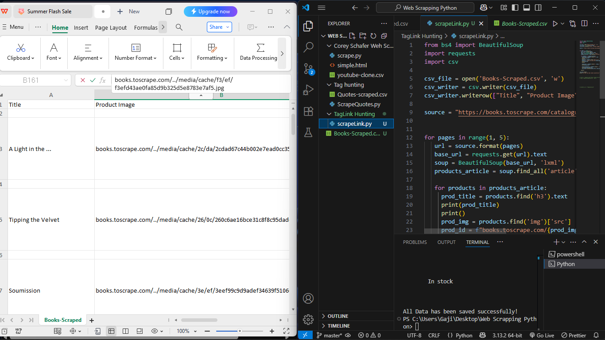

# 🕷️ Web Scraping Practice with Python

Welcome to my web scraping practice repository!

This project documents my learning journey and practice exercises as I explore the fundamentals and power of web scraping using **Python**, **BeautifulSoup**, and **Requests**.

---

## 📚 What I'm Learning

I'm actively learning and practicing web scraping to understand how to extract structured data from unstructured HTML content. Some of the key areas I've explored so far:

- ✅ **Tag Hunting**: Extracting headers, paragraphs, links, images, etc.
- ✅ **Containers and Loops**: Finding and iterating over repeated elements (e.g. product cards, quotes, video previews).
- ✅ **Pagination and Navigation**: Crawling multiple pages using for-loops and dynamic URLs.
- ✅ **Clean & Save**: Cleaning extracted data and saving it into structured files like `.csv`.

---

## 🛠️ Tools Used

- Python 🐍
- BeautifulSoup (for parsing HTML)
- Requests (for sending HTTP requests)
- CSV (for saving structured data)

---

## 🧪 What I’ve Practiced So Far

- Scraped quotes and authors from [Quotes to Scrape](https://quotes.toscrape.com/)
- Extracted product titles, prices, and image links from [Books to Scrape](https://books.toscrape.com/)
- Pulled video titles and links from a cloned video site
- Saved clean data into CSV files
- Used `.text`, `.find()`, `.find_all()` and even handled HTML class attributes properly
- Implemented basic error handling for missing elements
- Handled relative paths and image links

---

## 📁 Files in This Repo

- `quotes_scraper.py` – Scrapes author + quote from multiple pages
- `books_scraper.py` – Scrapes book titles, prices, ratings, and product image links
- `videos_scraper.py` – Scrapes video titles and links from a sample website
- `*.csv` – All CSV files generated from scraped data

---

## 🚀 Next Up

I’ll be diving into:
- 🔍 Smart filtering (e.g. filter quotes by tags or products by rating)
- 🧠 Real-world simulation (scraping real data from complex websites)
- 📦 Optional: Downloading images, exporting to JSON, or even building a GUI for scraping

---

## 🤝 Let’s Connect

Follow my journey on [X (Twitter)](https://x.com/codewithgaji) — I share helpful tech content and code every Saturday!  
Want to collaborate on a scraping or data project? Reach out!

---

> Built by [@codewithgaji](https://github.com/codewithgaji) 💻 | Learning never stops 🚀
